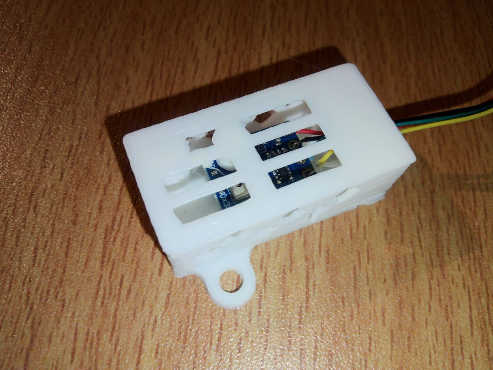

# Корпус AHT10 датчика

В данной папке вы найдете варианты корпуса для AHT10 датчика, который можно распечатать на 3D принтере.

`stl` папка содержит файлы, которые необходимо подготовить через слайсер для печати на своем принтере.

### Корпус AHT10 v2

 &emsp; &emsp; 

