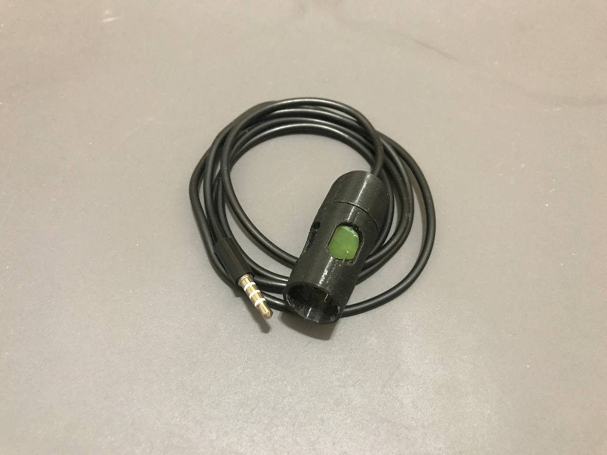
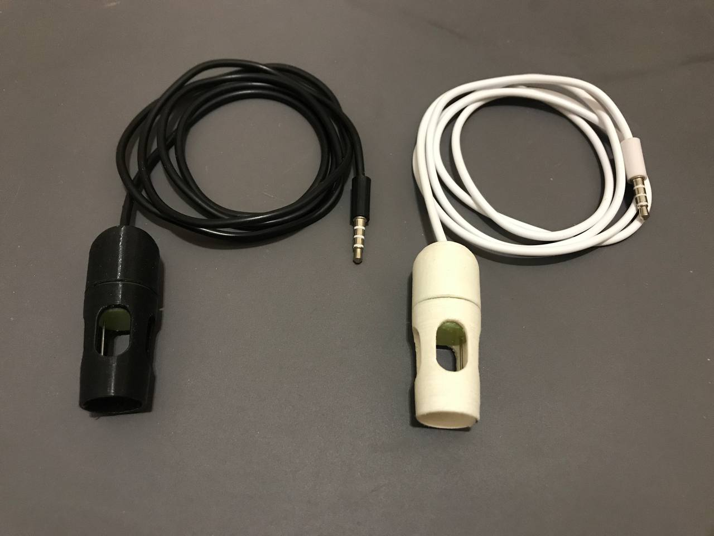
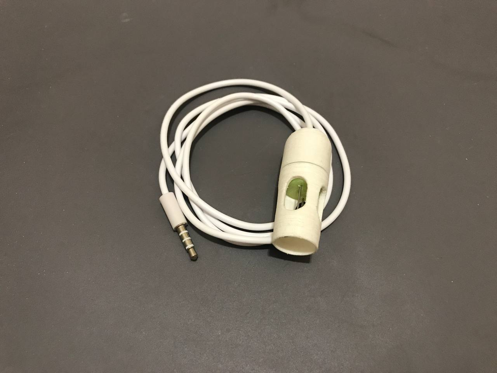

# Корпус ЕС электрода

В данной папке вы найдете варианты корпуса для ЕС электрода, который можно распечатать на 3D принтере.

Как можно видеть в каждой версии вариантов электрода есть две папки `openscad` и `stl`

`openscad` папка содержит в себе модель, которую можно динамически изменять и подстроить под себя в [openscad](https://openscad.org/downloads.html)

`stl` папка содержит файлы, которые необходимо подготовить через слайсер для печати на своем принтере.

### Корпус EC v5

&emsp;  &emsp; 

